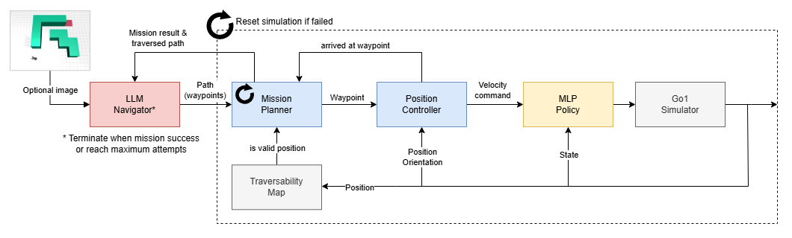

# MJX go1 playground with LLM navigation

This repository provides a toy example of using an LLM (Gemini 2.0 Thinking) to navigate a quadruped robot in an unknown environment through trial and error.

The LLM is given only the map size (5x5). Throughout the iterations, it receives feedback on the success or failure of the robot's attempts to follow waypoints, along with information about the traversed cells. This allows the LLM to potentially refine its guesses over time.

## Requirements
- Python 3.10+
- Refer to [tox.ini](tox.ini) for other dependencies 

## Result
### 1. Go1 locomotion 

The model was trained using notebooks in [mujoco_playground](https://github.com/google-deepmind/mujoco_playground). It features a recover policy that ensure success transitions between actions (handstand -> spin -> footstand).

 

### 2. LLM navigation via trial-and-error:  (text-based) and  (text-vision-based)
Leveraging the trained locomotion policy, this demo further enhance its autonomy by introducing navigation feature using LLM. Prototype of navigation of LLM w/o the quadruped simulation can be found in [this repo](https://github.com/shaoanlu/gemini_maze_exploration).

### 3. Collision avoidance using a safety filter 

A safety filter is introduced between the high-level velocity command generator and the low-level MLP policy. The safety filter is based on the control barrier function (CBF) method and is used to ensure that the robot does not collide with obstacles while following the velocity command.

- Left: w/o safety fillter
- Right: w/ safety fillter

## Learning Notes
- Each Go1 robot task uses a different environmental configuration (including noise parameters, mojoco model, initial poses, randomization settings, actuation calculations, etc.). Policies trained for one task generally don't perform well when applied to different task environments.
  - I was a little bit surprised as I expect RL policies be more robust.
  - Joystick XML: `FEET_ONLY_FLAT_TERRAIN_XML` (only feet-ground collision is enabled, also diff trunk collision geometry)
  - Handstand XML: `FULL_FLAT_TERRAIN_XML`
- AI generates much better test scripts when the code is  modularized and have clearly defined interface

## Memo
- `ruff format`
- `ruff check` or `ruff check --fix`