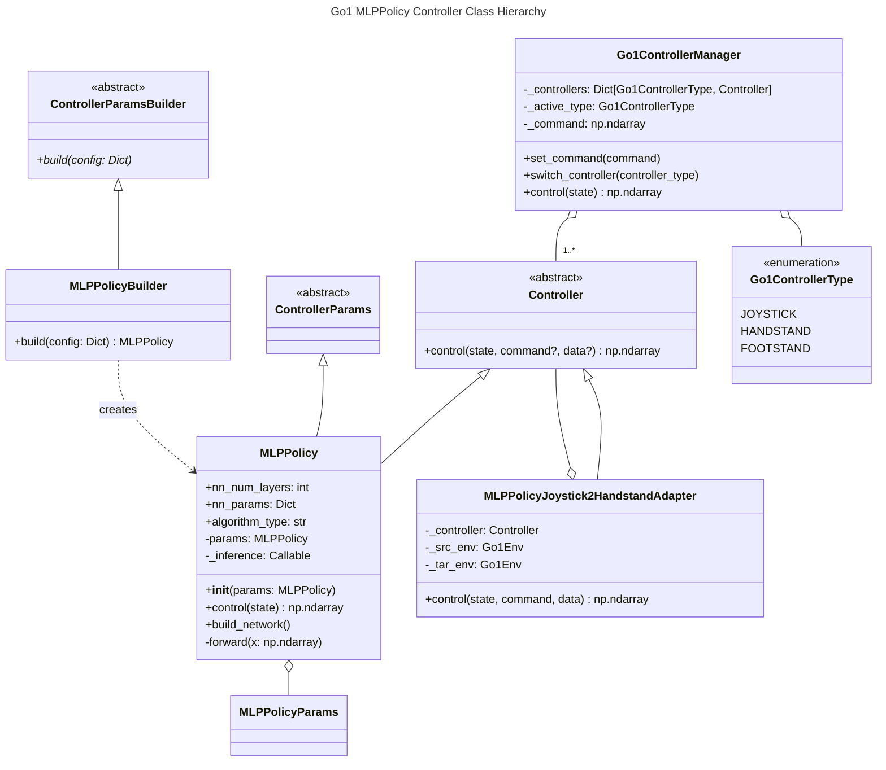

# Adopting The Template to Make A New MLPPolicy Policy For Mujoco Go1 Tasks


## Result
 

## Installation
```bash
pip install mujoco mujoco_mjx brax playground mediapy
```

## Execution
### In colab (recommended)
See [`colab demo`](locomotion.ipynb) notebook or [](https://colab.research.google.com/github/shaoanlu/llm_mjx_playground/blob/main/examples/colab_demo.ipynb)


## Architecture



### Learning notes
- Each Go robot task uses a different environmental configuration (including noise parameters, mojoco model, initial poses, randomization settings, actuation calculations, etc.). Policies trained for one task generally don't perform well when applied to different task environments.
  - I was a little bit surprised as I expect RL policies be more robust.
  - Joystick XML: `FEET_ONLY_FLAT_TERRAIN_XML` (only feet-ground collision is enabled, also diff trunk collision geometry)
  - Handstand XML: `FULL_FLAT_TERRAIN_XML`