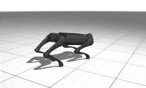
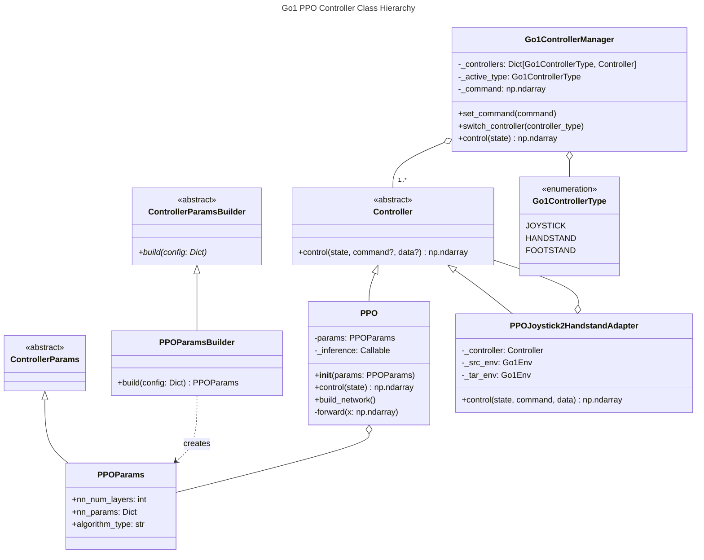

# Adopting The Template to Make A New PPO Policy For Mujoco Go1 Tasks

## File Description
- `ppo.py`: Implement a MLP network as well as the `Controller` interfaces based on the repo template.
- `env_wrapper.py` A wrapper to mujoco env to the `Env` interface of the repo template.
- `recovery_checker.py` Implement a falldown checker for the robot. Used for triggering the recovery (`Getup`) strategy.
- `demo.py`: The demo script. Result is shown below.
- `colab_demo.ipynb`: Another demosacript, which show more usage of design patterns (Factory, Strategy, and Adapter) in the context of Go1 control.

## Result
 

## Installation
```bash
pip install mujoco mujoco_mjx brax playground mediapy
```

## Execution
### In colab (recommended)
See [`colab_demo`](colab_demo.ipynb) notebook or [](https://colab.research.google.com/github/shaoanlu/control_system_project_template/blob/main/examples/mujoco_Go1/colab_demo.ipynb)

### Local
```bash
# navigate to root folder of the repo
python3 examples/mujoco_Go1/demo.py  --env_name Go1Handstand
# or
python3 examples/mujoco_Go1/demo.py  --env_name Go1JoystickFlatTerrain
```

## Architecture



### Learning notes
- Each Go robot task uses a different environmental configuration (including noise parameters, mojoco model, initial poses, randomization settings, actuation calculations, etc.). Policies trained for one task generally don't perform well when applied to different task environments.
  - I was a little bit surprised as I expect RL policies be more robust.
  - Joystick XML: `FEET_ONLY_FLAT_TERRAIN_XML` (only feet-ground collision is enabled, also diff trunk collision geometry)
  - Handstand XML: `FULL_FLAT_TERRAIN_XML`