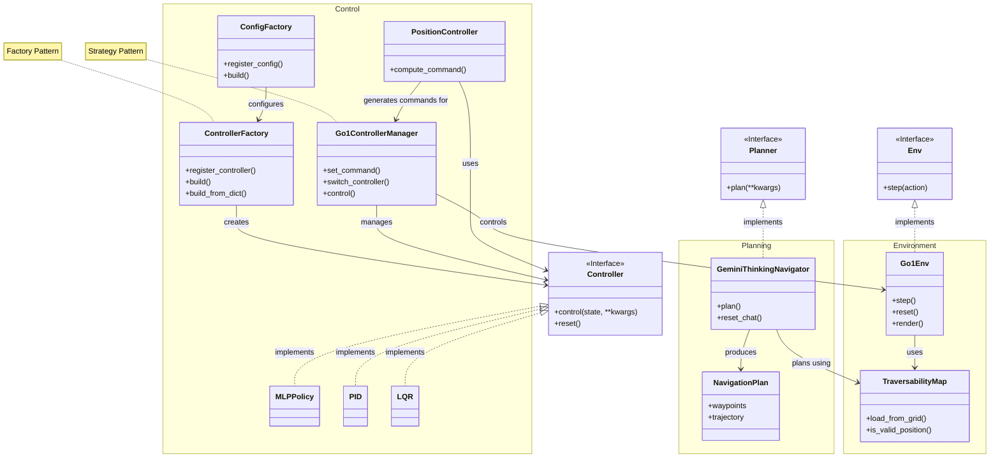

# Software Architecture Overview
## System Architecture
The repository implements a modular robotics control system with three main components:

1. Control (`/control`)
2. Planning (`/planning`)
3. Simulation environment (`/environment`)

The structure and relationships are illustrated below:

## Core Components
### 1. Control
Key templates:
 - [ControllerFactory](control/controller_factory.py) - Creates controller instances
 - [Controller](control/algorithm/base.py) - Control algorithm interface

Factory Pattern
- Used in control module for configuration and instantiation
- Separates object creation from algorithm logic

Strategy Pattern
- Used for switch policies during runtime (e.g. robot recovery from falling down)

### 3. Planning
- [Planner](planning/base.py) - Planning interface

### 4. Simulation Environment
- [Environment](environment/base.py) - Environment interface

## Configuration
- YAML-based configuration files in `/config`
- Separate configs for:
    - Control parameters
    - Environment settings
    - State estimation parameters
