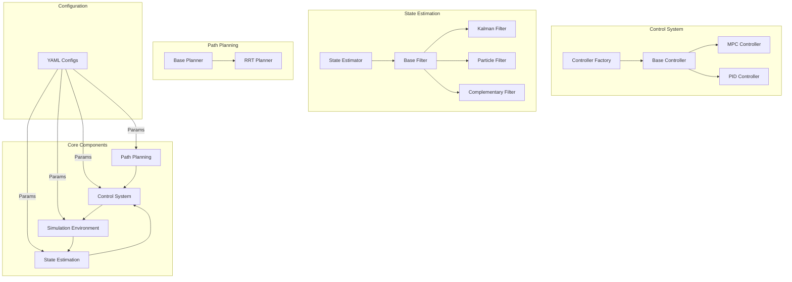

# Software Architecture Overview
## System Architecture
The repository implements a modular robotics control system with four main components:

1. Control (`/control`)
2. Estimation (`/estimation`)
3. Planning (`/planning`)
4. Simulation environment (`/env`)

## Core Components
### 1. Control
Key templates:
 - [ControllerFactory](control/controller_factory.py) - Creates controller instances
 - [Controller](control/algorithm/base.py) - Control algorithm interface

Factory Pattern
- Used in control module for configuration and instantiation
- Separates object creation from algorithm logic

Strategy Pattern
- To be implemented. Enables runtime algorithm selection
  
### 2. Estimation
Key templates:
  - [StateEstimator](estimation/state_estimator.py) - Creates state estimator interface consisting of fileter algorithms
  - [BaseFilter](estimation/algorithm/base.py) - Filter algorithm interface

Observer pattern
- Implemented in state estimation for sensor fusion
- Allows multiple filters to update state independently

### 3. Planning
- TBU

### 4. Simulation Environment
- TBU

## Configuration
- YAML-based configuration files in `/config`
- Separate configs for:
    - Control parameters
    - Environment settings
    - State estimation parameters
