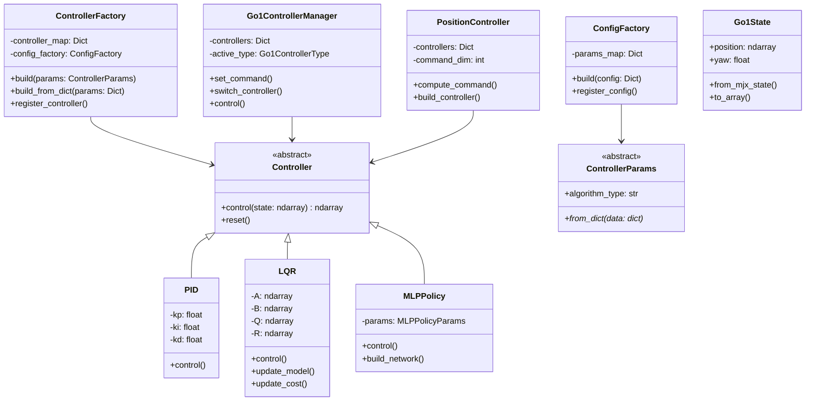

# Control System Architecture
This folder implements a flexible control system architecture that supports multiple control algorithms (PID, MPC, etc.) through a modular, extensible design. The architecture follows factory design patterns to ensure maintainability, testability, and ease of extension.



## Design Decisions
### Factory Pattern Implementation
We use the Factory pattern for several key reasons:

1. **Configuration Handling**: The `ConfigFactory` separates the complexity of parsing and validating configuration parameters from the controller implementations.
    ```python
    # Example usage
    config = load_yaml("controller_config.yaml")
    params = ConfigFactory().build(config)
    ```

2. **Controller Instantiation**: The `ControllerFactory` provides a clean interface for creating controller instances without exposing their construction details.
    ```python
    controller = ControllerFactory().build(params)
    ```

3. **Extensibility**: Adding new controller types only requires:
    - Implementing the new controller class
    - Adding a corresponding parameter builder
    - Registering them in the factory maps

### Separate Algorithm Directory
The control algorithms are organized in separate directories for several benefits:

1. **Modularity**: Each algorithm is self-contained with its own:
   - Controller implementation: for control logic
   - Parameter dataclass: for parameter type/name definitions
   - Parameter builder: for preprocessing of the params, e.g. conversion, validation, filtering etc.


2. **Dependency Management**: Algorithms can have their own requirements without affecting others:
   - MPC might depend on 3rd-party optimization libraries
   - PID might have simpler dependencies


3. **Testing**: Isolated algorithm directories enable:
   - Focused unit tests
   - Algorithm-specific test fixtures


## Adding New Controllers
To add a new controller type (e.g., MPPI):

1. Create a new file under `algorithm/`:
    ```
    algorithm/
    └── mppi.py
    ```

2. Implement required classes:
    ```python
    class MPPIParams(ControllerParams):
        algorithm_type: str = "mppi"
        # Define other parameters

    class MPPI(Controller):
        def control(self, state: np.ndarray, **kwargs) -> np.ndarray:
            # Control computation logic
            pass
    ```

3. Register in `control_factory.py`:
    ```python
    # In ConfigFactory
    self.params_map["mppi"] = MPPIParamsBuilder

    # In ControllerFactory
    self.controller_map[MPPIParams] = MPPI
    ```

4. Add/Update unit tests

## Configuration
Controllers can be configured via YAML files:
```yaml
algorithm_type: "mppi"
Q: [1.0, 1.0, 1.0, 1.0, 1.0]
R: [1.0, 1.0]
constraints:
  input_min: -1.0
  input_max: 1.0
model_params:
  # Model-specific parameters
```
