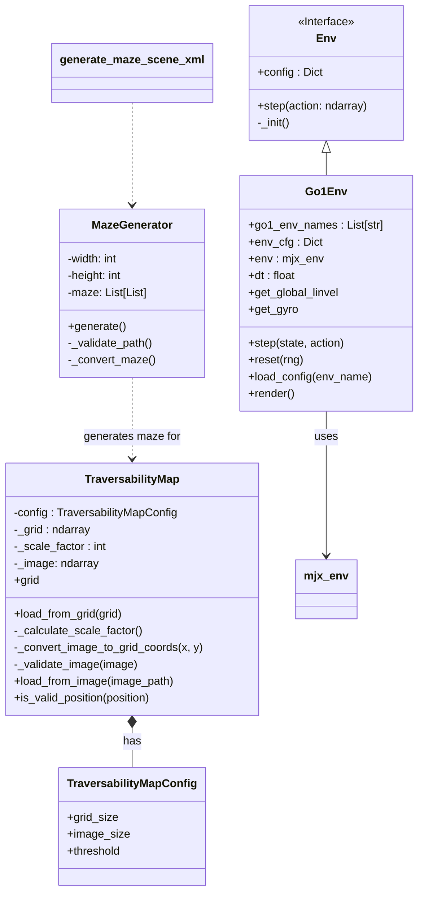

```mermaid
classDiagram
    class Env {
        <<Interface>>
        +config : Dict
        +step(action: ndarray)
        -_init()
    }

    class Go1Env {
        +go1_env_names : List[str]
        +env_cfg : Dict
        +env : mjx_env
        +step(state, action)
        +reset(rng)
        +load_config(env_name)
        +render()
        +dt : float
        +get_global_linvel
        +get_gyro
    }

    class TraversabilityMap {
        -config : TraversabilityMapConfig
        -_grid : ndarray
        -_scale_factor : int
        -_image: ndarray
        +load_from_grid(grid)
        -_calculate_scale_factor()
        -_convert_image_to_grid_coords(x, y)
        -_validate_image(image)
        +load_from_image(image_path)
        +is_valid_position(position)
        +grid
    }

    class TraversabilityMapConfig {
      +grid_size
      +image_size
      +threshold
    }

    class MazeGenerator{
        -width: int
        -height: int
        -maze: List[List]
        +generate()
        -_validate_path()
        -_convert_maze()
    }

    Env <|-- Go1Env
    TraversabilityMap *-- TraversabilityMapConfig : has
    Go1Env --> mjx_env : uses
    generate_maze_scene_xml ..> MazeGenerator
    MazeGenerator ..> TraversabilityMap : generates maze for
```