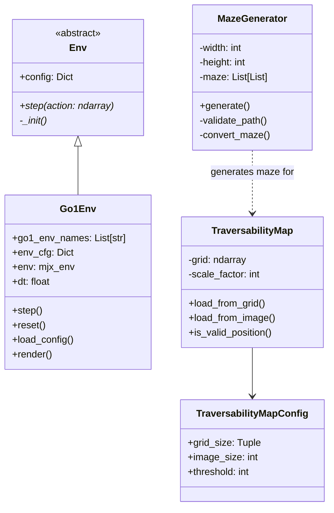

```mermaid
classDiagram
    %% Base Classes
    class Env {
        <<abstract>>
        +config: Dict
        +step(action: ndarray)*
        -_init()*
    }

    %% Environment Implementation
    class Go1Env {
        +go1_env_names: List[str]
        +env_cfg: Dict
        +env: mjx_env
        +step()
        +reset()
        +load_config()
        +render()
        +dt: float
    }

    %% Map and Maze Classes
    class TraversabilityMap {
        -grid: ndarray
        -scale_factor: int
        +load_from_grid()
        +load_from_image()
        +is_valid_position()
    }
    class TraversabilityMapConfig {
        +grid_size: Tuple
        +image_size: int
        +threshold: int
    }
    class MazeGenerator {
        -width: int
        -height: int
        -maze: List[List]
        +generate()
        -validate_path()
        -convert_maze()
    }

    %% Relationships
    Env <|-- Go1Env
    TraversabilityMap --> TraversabilityMapConfig
    MazeGenerator ..> TraversabilityMap : generates maze for
```