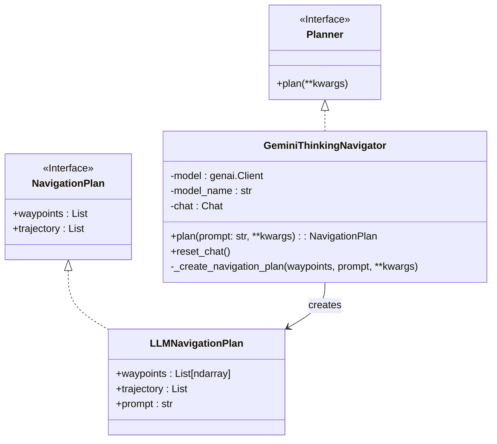

```mermaid
classDiagram
    class Planner {
        <<Interface>>
        +plan(**kwargs)
    }

    class NavigationPlan {
      <<Interface>>
        +waypoints : List
        +trajectory : List
    }

    class GeminiThinkingNavigator {
        -model : genai.Client
        -model_name : str
        -chat : Chat
        +plan(prompt: str, **kwargs) : NavigationPlan
        +reset_chat()
        -_create_navigation_plan(waypoints, prompt, **kwargs)
    }

    class LLMNavigationPlan {
        +waypoints : List[ndarray]
        +trajectory : List
        +prompt : str
    }

    Planner <|.. GeminiThinkingNavigator
    NavigationPlan <|.. LLMNavigationPlan
    GeminiThinkingNavigator --> LLMNavigationPlan : creates
```