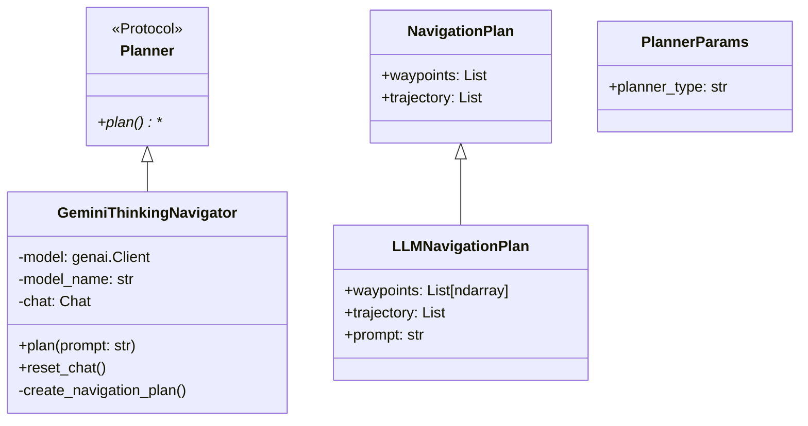

```mermaid
classDiagram
    %% Base Classes
    class Planner {
        <<Protocol>>
        +plan()**
    }
    class NavigationPlan {
        +waypoints: List
        +trajectory: List
    }
    class PlannerParams {
        +planner_type: str
    }

    %% LLM Navigation Classes
    class GeminiThinkingNavigator {
        -model: genai.Client
        -model_name: str
        -chat: Chat
        +plan(prompt: str)
        +reset_chat()
        -create_navigation_plan()
    }
    class LLMNavigationPlan {
        +waypoints: List[ndarray]
        +trajectory: List
        +prompt: str
    }

    %% Relationships
    Planner <|-- GeminiThinkingNavigator
    NavigationPlan <|-- LLMNavigationPlan
```